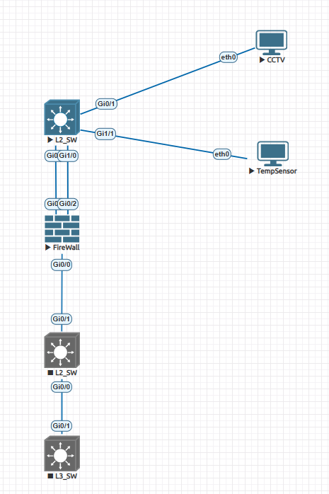

# IoT Network Lab 1

EVE-NG 기반의 IoT 네트워크 실습 구성을 저장하는 저장소입니다.

## 구성 장비

- L2_SW_1: CCTV 및 TempSensor가 연결된 엣지 스위치
- Firewall: VLAN 보안 분리
- L2_SW_2 / L3_SW: 코어/백본 스위치
- Endpoints: CCTV와 TempSensor

## 토폴로지

